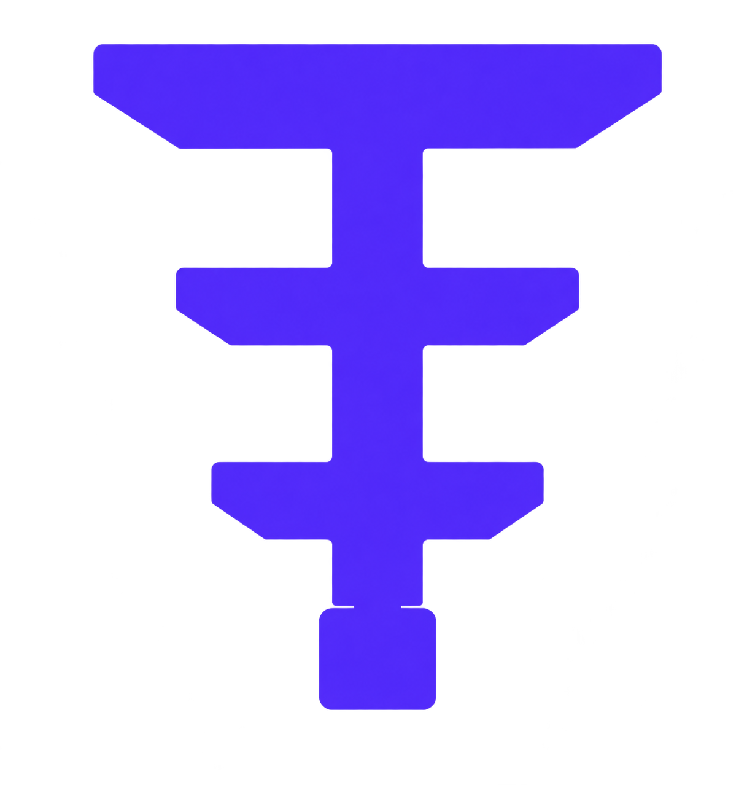

<p align="center">
  
</p>

# Superfermion

A high-performance quantum computing framework with a Python API and a
Rust simulation core. Statevector, MPS, stabilizer, and density matrix
simulation methods with native adjoint differentiation, quantum error
correction, and multi-framework interop.

[](https://python.org)
[](https://rust-lang.org)
[](https://opensource.org/licenses/Apache-2.0)

---

## What is Superfermion?

Superfermion is a quantum computing framework that combines a Python-native API
with a Rust acceleration core (Rayon multithreading + in-place statevector).

- **4 simulation methods** — statevector (CPU/GPU), MPS tensor network,
  stabilizer (Aaronson-Gottesman tableau), density matrix (Kraus channels)
- **Adjoint differentiation** — 1 forward + 1 backward pass regardless of
  parameter count (44–198x faster than parameter-shift on deep circuits)
- **MPS tensor networks** — Rust MPS with faer-based QR decomposition and
  lazy SWAP routing; scales to 200+ qubits for low-entanglement circuits
- **Stabilizer simulator** — word-packed tableau; Clifford circuits at
  poly-time to ~1000 qubits
- **Quantum Error Correction** — stabilizer code constructions
  (Repetition, Shor, Steane, Surface) + decoders (BP+OSD, greedy
  matching, Union-Find, Neural); additional codes in progress
- **Multi-framework ML** — `QuantumLayer` (Flax), `TorchQuantumLayer`
  (PyTorch), `TFQuantumLayer` (TensorFlow)
- **5 gradient methods** — adjoint, parameter-shift, SPSA, QNG, Riemannian
- **Quantum algorithms** — VQE, QAOA, Grover, QPE, HHL, Amplitude Estimation
- **Chemistry module** — Jordan-Wigner + Bravyi-Kitaev transformations,
  UCCSD ansatz, PySCF bridge, molecular Hamiltonian library
- **Hardware compilation** — gate decomposition, rotation merging, SABRE
  qubit routing, Pauli twirling; targets IBM, Rigetti, IonQ, IQM
- **QPU providers** — IBM Quantum, IonQ, AWS Braket, OpenQuantum
- **Cross-framework bridges** — Qiskit, Cirq, PennyLane, OpenQASM 2/3

---

## Installation

```bash
git clone https://github.com/Catstate101/superfermion.git
cd superfermion
pip install -e .

# Build the Rust extension (required for simulation)
pip install maturin
cd crates/sf-bindings && maturin develop --release && cd ../..

# Copy the built extension into the package
# Linux:
cp target/release/lib_sf_core.so superfermion/_sf_core.so
# macOS:
# cp target/release/lib_sf_core.dylib superfermion/_sf_core.so
# Windows:
# cp target/release/_sf_core.dll superfermion/_sf_core.pyd
```

Requirements: Python 3.10–3.13, Rust 1.75+, ~3 GB free disk for the Rust build.

Optional dependency groups:
```bash
pip install -e ".[dev]"        # pytest, ruff, mypy, black
pip install -e ".[gpu]"        # JAX with CUDA 12
pip install -e ".[qpu]"        # IBM + AWS Braket SDKs
pip install -e ".[benchmarks]" # PennyLane, Qiskit Aer, pandas, matplotlib
pip install -e ".[chemistry]"  # PySCF, SciPy
pip install -e ".[viz]"        # matplotlib
pip install -e ".[all]"        # everything
```

---

## Quick Start

```python
import superfermion as sf

# Bell state
qc = sf.Circuit(2).h(0).cx(0, 1)
result = sf.run(qc, device="cpu", shots=1024)
print(result.counts)  # {'00': ~512, '11': ~512}

# Exact simulation with sf.simulate()
state = sf.simulate(qc, device="cpu")
print(state.numpy())       # [0.707+0j, 0, 0, 0.707+0j]
print(state.entropy())     # 0.0 (pure state)
print(state.purity())      # 1.0

# Expectation value (Rust-native)
zz_obs = [([3, 3], 1.0, 0.0)]  # ZZ observable
print(state.expectation(zz_obs))  # 1.0

# Parameterized circuit with gradient
qc = sf.Circuit(1).ry(sf.param("theta"), 0)
bound = qc.bind({"theta": 0.5})
state = sf.simulate(bound, device="cpu")
grads = state.grad([([3], 1.0, 0.0)], qc.to_ir(), {"theta": 0.5})
print(grads)  # {"theta": -0.479...}
```

---

## Architecture

**Python is the API, Rust Does the Work.** All performance-critical computation runs in Rust. Python provides the fluent API surface. JAX is used only in `nn/quantum_layer.py` for the Flax `custom_vjp` bridge.

```
Python API (superfermion/)
    |-- Circuit, run(), simulate(), State, MethodError, RunResult
    |-- devices/      RustDevice (CPU/GPU), IBM, IonQ, Braket providers
    |-- observables/   PauliString, SparsePauliOp, Hamiltonian, expval
    |-- qml/          gradients (adjoint, param-shift, SPSA, QNG, Riemannian, SR)
    |-- nn/           Thin ML bridges: Flax/PyTorch/TF → sf.State.grad()
    |-- algorithms/   VQE, QAOA, QSVM, QBM, QRL + Grover, QPE, HHL
    |-- chemistry/    JW/BK transforms, UCCSD ansatz, PySCF bridge
    |-- qec/          codes + 4 decoders
    |-- compiler/     gate decomposition, rotation merge, SABRE routing
    |-- bridge/       Qiskit, Cirq, PennyLane, QASM interop
    |-- noise/        NoiseModel (Kraus channels for density matrix)
    |
    +-- _sf_core  (Rust PyO3 extension: State, QuantumDAG, ...)

Rust workspace (crates/)
    |-- sf-ir/        QuantumStateImpl trait, DAG, statevector, MPS,
    |                 stabilizer, density matrix simulation engines
    |-- sf-compiler/  Pass manager, gate cancellation, rotation merge
    |-- sf-router/    SABRE routing, hardware topology
    |-- sf-qec/       Stabilizer codes, MWPM/UnionFind decoders
    |-- sf-gpu/       CUDA statevector simulation (cudarc, sm_75+)
    |-- sf-bindings/  PyO3 FFI — State, QuantumDAG, compile
```

### Execution flow

```
sf.run(circuit, device="cpu", method="statevector", shots=N)
    │
    ▼
runner.py — resolve device, bind params, optional compile
    │
    ▼
RustDevice.execute(dag, method, shots)
    │
    ├── statevector    → dag.simulate()             [Rust, Rayon]
    ├── mps            → dag.simulate_mps()         [Rust, faer]
    ├── stabilizer     → dag.simulate_stabilizer()  [Rust, tableau]
    ├── density_matrix → dag.simulate_dm_noisy()    [Rust, Kraus]
    └── gpu            → dag.simulate_gpu()         [CUDA]
    │
    ▼
sf.State (Rust-native) → RunResult(counts, state, metadata)
```

---

## Simulation Methods

| Method | Max Qubits | Best For |
|---|---|---|
| `statevector` (default) | ~25 CPU, ~30 GPU | Exact simulation, gradient computation |
| `mps` | 200+ | Low-entanglement circuits (QAOA, VQE, GHZ) |
| `stabilizer` | ~1000 | Clifford-only circuits (QEC, randomized benchmarking) |
| `density_matrix` | ~12 | Noisy simulation with Kraus channels |

```python
# MPS simulation
result = sf.run(circuit, device="cpu", method="mps", shots=10000, bond_dim=64)

# Stabilizer simulation
result = sf.run(clifford_circuit, device="cpu", method="stabilizer", shots=10000)

# GPU simulation (requires CUDA)
result = sf.run(circuit, device="gpu", shots=0)
```

---

## Benchmarks

Performance measured against Qiskit Aer 0.17 and PennyLane Lightning 0.45
on CPU (details in [`notebooks/`](notebooks/)). Speedups are regime-dependent;
the caveats below are part of the claim.

| Workload | SF vs Competitor | Speedup |
|---|---|---|
| Statevector (n=10–18) | vs Qiskit Aer statevector | up to ~5x (Aer faster at n≥20) |
| Stabilizer (n=10–500, 10k shots) | vs Qiskit Aer stabilizer | 3–7x |
| MPS GHZ (n=10–100, 10k shots) | vs Qiskit Aer MPS | 23–33x (GHZ is the best case for MPS) |
| Adjoint gradient (n=4–16, depth=1) | vs PennyLane `qml.grad` | 1.5–800x (PennyLane faster at n≥18) |
| Adjoint vs param-shift (n=10, depth 1–8) | SF internal | 44–198x (grows with depth) |
| Shot sampling (n=10–22, 100k shots) | vs Qiskit Aer | 1.4–11.7x (Aer wins at 1k–10k shots, n≥20) |

---

## Key Modules

### Gradients

| Method | File | Description |
|---|---|---|
| Adjoint | `qml/gradient/adjoint.py` | 1 forward + 1 backward pass; fastest for most QML |
| Parameter-shift | `qml/gradient/parameter_shift.py` | 2 forward passes per param; analytic |
| Finite difference | `qml/gradient/parameter_shift.py` | Centered difference fallback |
| SPSA | `qml/gradient/spsa.py` | Stochastic approximation; noisy-hardware friendly |
| Quantum Natural | `qml/gradient/qng.py` | Fubini-Study metric; faster convergence |

### Machine Learning Layers

```python
from superfermion.nn.quantum_layer import QuantumLayer     # Flax (JAX)
from superfermion.nn.torch_layer import TorchQuantumLayer  # PyTorch
from superfermion.nn.tf_layer import TFQuantumLayer        # TensorFlow
```

### Quantum Error Correction

```python
from superfermion.qec import SurfaceCode2D, MWPMDecoder, QECManager

code = SurfaceCode2D(distance=3)
circuit = code.build()
```

### Cross-Framework Bridge

```python
from superfermion.bridge import from_qiskit, to_qiskit, from_pennylane, to_cirq

sf_circuit = from_qiskit(qiskit_circuit)
qiskit_circuit = to_qiskit(sf_circuit)
```

---

## Documentation

Full documentation is available at [superfermion.com](https://superfermion.com) (or [superfermion-docs.pages.dev](https://superfermion-docs.pages.dev)).

| Document | Content |
|---|---|
| [`docs/usage_guide.md`](docs/usage_guide.md) | Canonical API reference with runnable examples |
| [`docs/architecture.md`](docs/architecture.md) | Hexagonal architecture, module map, execution flow |
| [`CONTRIBUTING.md`](CONTRIBUTING.md) | Contribution guide |
| [`CHANGELOG.md`](CHANGELOG.md) | Release history |

---

## Citing

```bibtex
@misc{superfermion-2026,
  title  = {SuperFermion: a high-performance quantum-circuit simulator
            with native adjoint differentiation},
  author = {SuperFermion Team},
  year   = {2026},
  url    = {https://github.com/Catstate101/superfermion}
}
```

## License

[Apache License 2.0](LICENSE).
